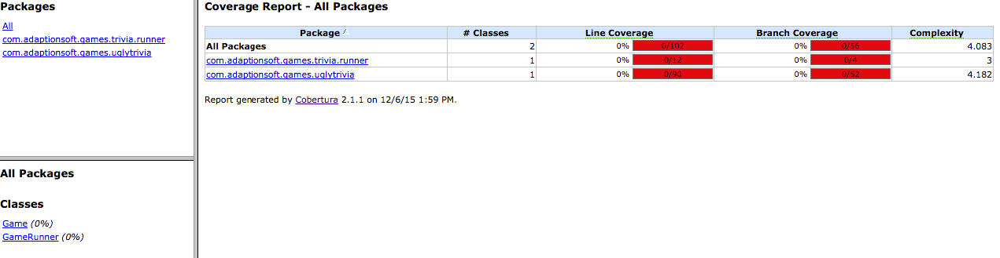

This is the Java package of the Ugly Trivia!


To provide some help for the Legacy Code Retreat, we pre-wired JUnit and Cobertura already as part of the Maven definition.

1. If you don't have Maven, please install it: https://maven.apache.org/install.html
2. You can run the following commands to generate the report

```
mvn clean cobertura:cobertura
```

3. You can open the HTML file: target/site/cobertura/index.html


You should see something like this (initially): 



