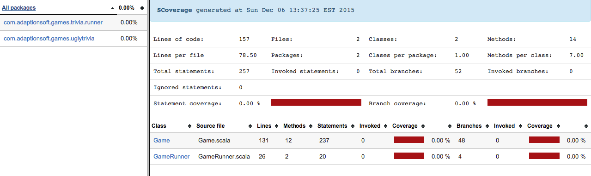

This is the Scala package of the Ugly Trivia!


To provide some help for the Legacy Code Retreat, we pre-wired ScalaTest and Scoverage already as part of the SBT definition.

1. If you don't have SBT, please install it: http://www.scala-sbt.org/release/tutorial/Setup.html
2. You can run the following commands to generate the report

```
sbt clean coverage test coverageReport
```

3. You can open the HTML file: ./target/scala-2.11/scoverage-report/index.html

You should see something like this (initially): 



